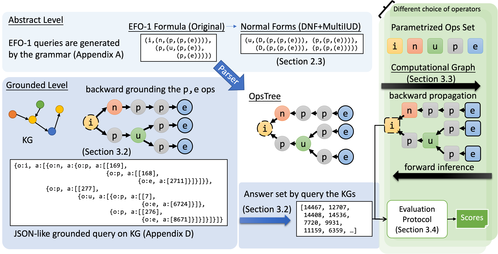

# EFO-1-QA Benchmark for Complex Query Answering on Knowledge Graphs

This repository contains an entire pipeline for the EFO-1-QA benchmark. EFO-1 stands for the Existential First Order Queries with Single Free Varibale. The related paper has been accepted by the NeurIPS 2021 track on dataset and benchmark (see [OpenReview Link](https://openreview.net/forum?id=pX4x8f6Km5T)), and appeared on [arXiv](https://arxiv.org/abs/2109.08925).

The data used in the evaluation can be found in this open link https://hkustconnect-my.sharepoint.com/:f:/g/personal/zwanggc_connect_ust_hk/EpaFL1PUoOFBuCc7hclIM30B8c21e-Tnv1gL11jw_z_SQQ?e=m8RJb5. The compressed version is about 5 GB.


If this work helps you, please cite
```
@inproceedings{wang2021benchmarking,
title={Benchmarking the Combinatorial Generalizability of Complex Query Answering on Knowledge Graphs},
author={Zihao Wang and Hang Yin and Yangqiu Song},
booktitle={NeurIPS Datasets and Benchmarks Track},
year={2021},
url={https://openreview.net/forum?id=pX4x8f6Km5T}
}
```

## The pipeline overview.



1. **Query type generation and normalization** The query types are generated by the DFS iteration of the context free grammar with the bounded negation hypothesis. The generated types are also normalized to several normal forms
2. **Query grounding and answer sampling** The queries are grounded on specific knowledge graphs and the answers that are non-trivial are sampled.
3. **Model training and estimation** We train and evaluate the specific query structure 

## Query type generation and normalization
The OpsTree is represented in the nested objects of `FirstOrderSetQuery` class in `fol/foq_v2.py`. 
We first generate the specific OpsTree and then store it by the `formula` property of `FirstOrderSetQuery`.

The OpsTree is generated by `binary_formula_iterator` in `fol/foq_v2.py`. The overall process is managed in `formula_generation.py`.

To generate the formula, just run
```bash
python formula_generation.py
```

Then the file formula csv is generated in the `outputs` folder.
In this paper, we use the file in `outputs/test_generated_formula_anchor_node=3.csv`

## Query grounding and answer sampling

We first prepare the KG data and then run the sampling code

The KG data (FB15k, FB15k-237, NELL995) should be put into under 'data/' folder. We use the [data](http://snap.stanford.edu/betae/KG_data.zip) provided in the [KGReasoning](https://github.com/snap-stanford/KGReasoning).

The structure of the data folder should be at least

```
data
	|---FB15k-237-betae
	|---FB15k-betae
	|---NELL-betae	
```

Then we can run the benchmark sampling code on specific knowledge graph by
```bash
python benchmark_sampling.py --knowledge_graph FB15k-237 --num_samples 5000
python benchmark_sampling.py --knowledge_graph FB15k --num_samples 8000
python benchmark_sampling.py --knowledge_graph NELL --num_samples 4000
```

**Append new forms to existing data**
One can append new forms to the existing dataset by
```bash
python append_new_normal_form.py --knowledge_graph FB15k-237 
```

## Model training and estimation

**Models**

- [x] [BetaE](https://arxiv.org/abs/2010.11465)
- [x] [Query2box](https://arxiv.org/abs/2002.05969)
- [x] [NewLook](http://tonghanghang.org/pdfs/kdd21_newlook.pdf)
- [x] [LogicE](https://arxiv.org/abs/2103.00418)

**Examples**

The detailed setting of hyper-parameters or the knowledge graph to choose are in `config` folder,
you can modify those configurations to create your own, all the experiments are on FB15k-237 by default.


Besides, the generated benchmark, one can also use the BetaE dataset after 
converting to our format by running:

```bash
python transform_beta_data.py
```

Use one of the commands in the following to do training, depending on the choice of models and choices of data type:

```bash
python main.py --config config/{data_type}_{model_name}.yaml
```

- The `data_type` includes `EFO-1` and `beta`
- The `model_name` includes `BetaE`, `LogicE`, `NewLook` and `Query2Box`

If you need to evaluate on the EFO-1-QA benchmark, be sure to load from existing model checkpoint, you can
train one on your own or download
from [here](https://drive.google.com/drive/folders/13S3wpcsZ9t02aOgA11Qd8lvO0JGGENZ2?usp=sharing):

```bash
python main.py --config config/evaluate_BetaE.yaml --checkpoint_path ckpt/FB15k-237/Beta_full
python main.py --config config/evaluate_NewLook.yaml --checkpoint_path ckpt/FB15k-237/NLK_full --load_step 450000
python main.py --config config/evaluate_LogicE.yaml --checkpoint_path ckpt/FB15k-237/Logic_full --load_step 450000
```
We note that the BetaE checkpoint above is trained from [KGReasoning](https://github.com/snap-stanford/KGReasoning)

## Paper/Repository Checklist

1. For all authors..

	(a)  Do the main claims made in the abstract and introduction accurately reflect the paper's contributions and scope? **Yes**

	(b) Have you read the ethics review guidelines and ensured that your paper conforms to them? **Yes**

	(c) Did you discuss any potential negative societal impacts of your work? **No**

	(d) Did you describe the limitations of your work? **Yes**

2. If you are including theoretical results...

	(a) Did you state the full set of assumptions of all theoretical results? **N/A**

	(b) Did you include complete proofs of all theoretical results? **N/A**

3. If you ran experiments...

	(a) Did you include the code, data, and instructions needed to reproduce the main experimental results (either in the supplemental material or as a URL)? **Yes**

	(b) Did you specify all the training details (e.g., data splits, hyperparameters, how they were chosen)? **Yes**

	(c) Did you report error bars (e.g., with respect to the random seed after running experiments multiple times)? **No**

	(d) Did you include the amount of compute and the type of resources used (e.g., type of GPUs, internal cluster, or cloud provider)? **No**

4. If you are using existing assets (e.g., code, data, models) or curating/releasing new assets...

	(a) If your work uses existing assets, did you cite the creators? **Yes**

	(b) Did you mention the license of the assets? **No**

	(c) Did you include any new assets either in the supplemental material or as a URL? **Yes**

	(d) Did you discuss whether and how consent was obtained from people whose data you're using/curating? **N/A**

	(e) Did you discuss whether the data you are using/curating contains personally identifiable information or offensive content? **N/A**

5. If you used crowdsourcing or conducted research with human subjects...

	(a) Did you include the full text of instructions given to participants and screenshots, if applicable? **N/A**

	(b) Did you describe any potential participant risks, with links to Institutional Review Board (IRB) approvals, if applicable? **N/A**

	(c) Did you include the estimated hourly wage paid to participants and the total amount spent on participant compensation? **N/A**
